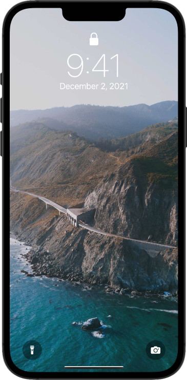

# Remaking the iOS lock screen

Based on Paul Hudson [HWS+](https://www.hackingwithswift.com/plus/) "Remaking apps" article, we are building the iOS lock screen.

- Edge-to-edge background image (without status bar)
- Date and time (using localized formatting, without AM/PM symbols)
- Simulation of the lock screen buttons (including flashlight button inverting and giving a haptic feedback)
- Use "torch" of your devices camera as flashlight 

## Screenshot

